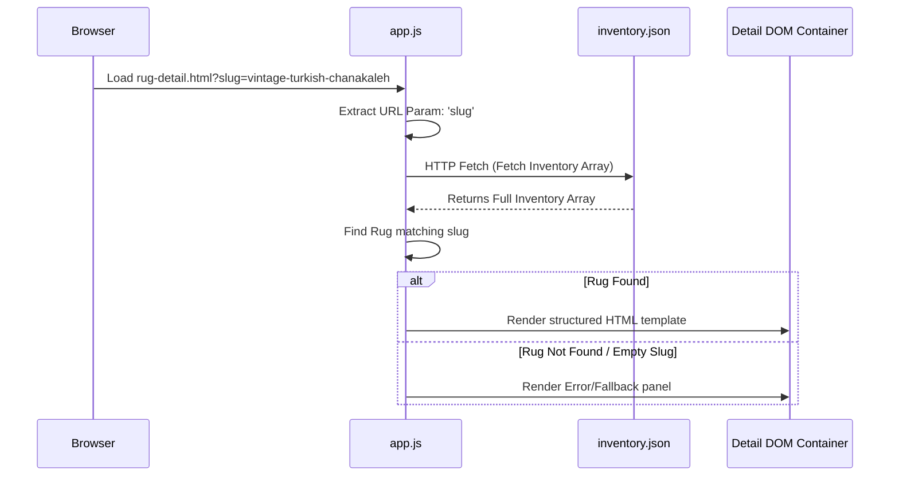

# Architecture Blueprint — Noor Oriental Rugs

This document details the software architecture, data design, and layout structures of the Noor Oriental Rugs catalog.

---

## 1. Dynamic Client-Side Routing (SPA-Lite)

The detail pages of the product catalog (specifically [rug-detail.html](file:///c:/Users/Robbe/.gemini/antigravity/scratch/boston-rugs-landing/rug-detail.html)) operate as dynamic, single-page templates populated client-side.



### Script Loader Logic
URL parameters are parsed inside [app.js](file:///c:/Users/Robbe/.gemini/antigravity/scratch/boston-rugs-landing/app.js):
```javascript
const urlParams = new URLSearchParams(window.location.search);
const slug = urlParams.get('slug');
```
The client fetches the master dataset, matches the rug entry, injects SEO meta tags dynamically to the document header, and formats page sections.

---

## 2. Flat-File Database Schema (`inventory.json`)

Rug items are stored as object elements in [inventory.json](file:///c:/Users/Robbe/.gemini/antigravity/scratch/boston-rugs-landing/inventory.json).

```json
{
  "id": 11,
  "name": "Vintage Turkish Chanakaleh Rug",
  "slug": "vintage-turkish-chanakaleh",
  "origin": "Turkey",
  "material": "100% Wool",
  "weave": "Hand Knotted",
  "condition": "Professionally Restored / Excellent",
  "price": 2450,
  "size": "2'10\" x 4'1\"",
  "style": "Vintage",
  "age": "Less than 50 Years Old",
  "availability": "Only One Available",
  "specifications": {
    "dimensions": "2'10\" x 4'1\" (86 cm x 124 cm)",
    "warp_weft": "100% Organic Wool Warp & Weft",
    "knot_density": "Thick Double Knot Weave (~80,000 knots/sqm)",
    "thickness": "Low profile dense pile (~6mm)",
    "dyes": "Natural Organic Pigments",
    "restoration_details": "Professionally washed (green shampoo), fringe secured, side bindings reinforced."
  },
  "images": [
    {
      "file": "images/chanakaleh_hero.jpg",
      "alt": "Vintage Turkish Chanakaleh Wool Rug - Hand Knotted Anatolian Masterpiece Full View",
      "order": 1
    }
  ],
  "seo": {
    "title": "Vintage Turkish Chanakaleh Wool Rug | Noor Oriental Rugs",
    "description": "Discover this rare, one-of-a-kind 2'10\" x 4'1\" hand-knotted vintage Turkish Chanakaleh wool rug, professionally restored and hand-washed."
  },
  "description": "### Overview\nDescription text here...",
  "story": "### The Chanakaleh Weaving Tradition\nStory content here..."
}
```

---

## 3. Visual Layout Architecture

The dynamic detail page uses a **sticky double-column split layout** on desktop screens and shifts to a stacked single-column block layout on tablets and mobile devices.

### CSS Grid Alignment Properties
* **Specs Grid**: Configured with CSS Grid auto-fit properties to maintain equal card heights:
  ```css
  .rug-detail-specs-grid {
      display: grid;
      grid-template-columns: repeat(auto-fit, minmax(180px, 1fr));
      gap: 1.25rem;
  }
  .rug-detail-spec-box {
      display: flex;
      flex-direction: column;
      height: 100%;
  }
  ```
* **Gallery Thumbnails**: Laid out in a horizontally scrollable container below the main image:
  ```css
  .rug-detail-thumbs {
      display: flex;
      gap: 12px;
      overflow-x: auto;
      white-space: nowrap;
      padding-bottom: 8px;
  }
  ```

---

## 4. Cache-Busting Sync System

To bypass strict CDN and browser caches, all style and script references in [rug-detail.html](file:///c:/Users/Robbe/.gemini/antigravity/scratch/boston-rugs-landing/rug-detail.html) must include incremented version query parameters:
```html
<link rel="stylesheet" href="styles.css?v=1.0.19">
<script src="app.js?v=10"></script>
```
When updating layout behaviors (`app.js`) or core styling rules (`styles.css`), developers must increment the `?v=` parameter to force immediate client reloading.
